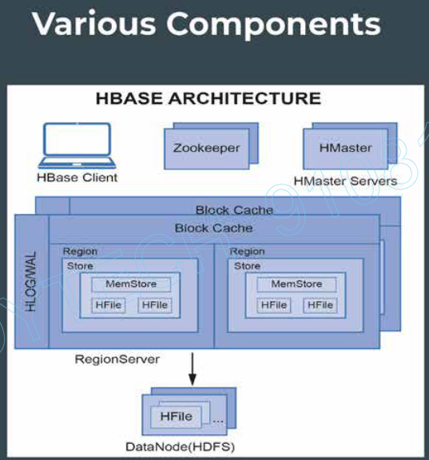

# HBase Architecture

1. Region Server
2. Region
3. Memstore
4. Wal
5. Block Cache
6. HFile
7. Zookeeper
8. HMaster

Let's say we have a table `employee`, which contains 2 column families and each column family contains 3 columns each. The row-key of this table `employee` is `employee id`.
There are 10,000 records in the `employee` table.

These 10K records would be stored in multiple `regions`. 

region1 => 1-2500  
region2 => 2501-5000  
region3 => 5001-7500  
region4 => 7501-10000  

Each `region-server` holds multiple `regions`. Each `region` holds the data sorted based on row-keys.

region-server1 => region1 & region2  
region-server2 => region3 & region4

*Region Servers typically have one-to-one mapping with data nodes.*  
i.e. if we have 4 data-nodes, we will have 4 region-servers, each running on one data-node.

Note: Column families will also be stored in separate files.  

**`MemStore`** - Whenever we want to write new records, these records will be stored in Memstore. When the size of the memstore grows to a threshold size then the content of the memstore will be flushed to the disk and a new file will be created. This file which is created from the memstore flush is called a `HFile`. *For each region, there is a memstore for every column family.* 

**Note**: If we write new inserts directly to HDFS, there will be many small files that get created for each insert. This is a huge problem hence Memstore & HFiles are used.

**`WAL`** - Write Ahead Log - Stored on Disk (HDFS) 
Consider the data is still in memstore and the data-server crashes - Since the data was in memory, there will be  data-loss. This data loss is tackled by WAL. Whenever there are any inserts, the data is first written to WAL and then to Memstore to mitigate the data loss.

**`Block Cache`** - Whenever data is read, it gets cached in memory. For next reads, it might get the data directly from the cache to speed-up query time.  
*WAL & Block Cache are `one` per region-server.*

**`Zookeeper`** - Its a co-ordinating service for various distributed systems. Every server will send the heartbeat to zookeeper. It also holds the location of the meta-table.  
Meta-table - table which holds the mapping of `regions` & `region-servers`. This meta-table is stored in one of the region-server, zookeeper keeps a track of which region server holds the meta-table.

### HBase has a master-slave architecture.
**`HMaster`** - It's the master & region-servers are the slaves. HMaster will assign regions to region-servers.  
In case of any failures/load increase, HMaster will try to balance the load by assigning some of the regions in loaded region-server to other region-servers.

