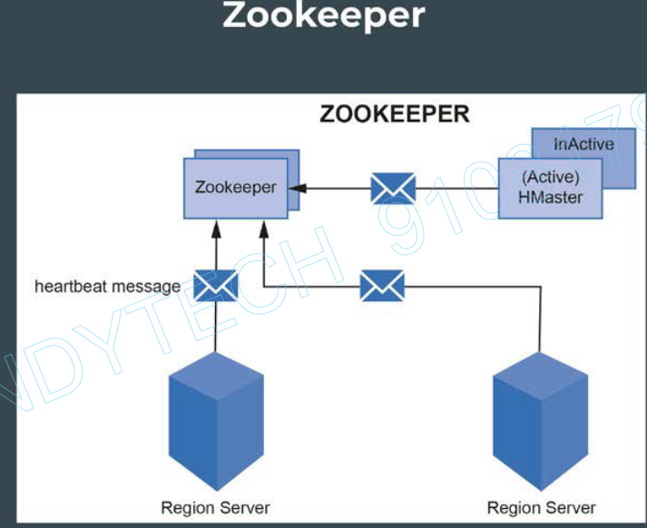
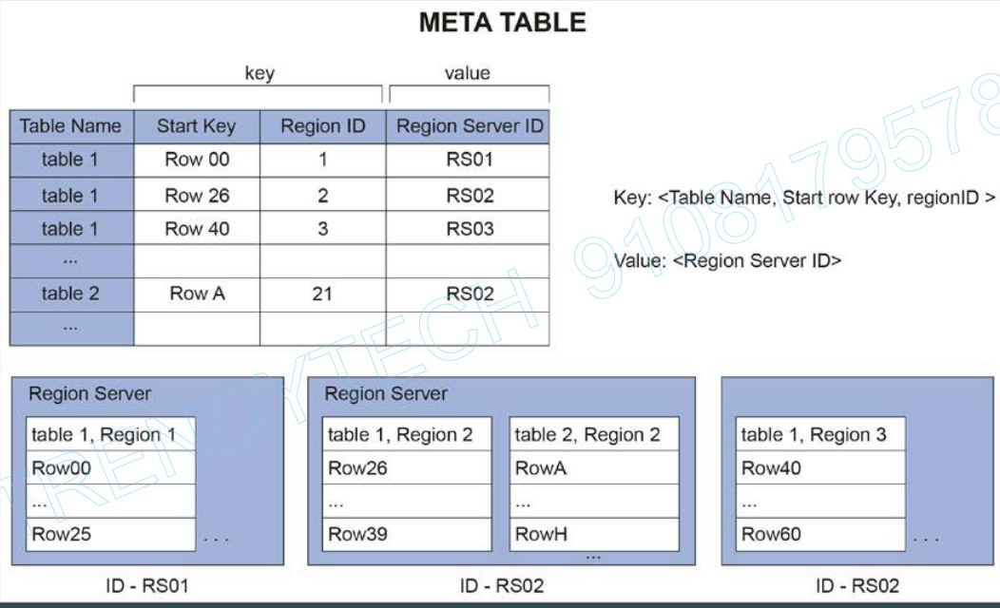

# HBase Architecture

1. Region Server
2. Region
3. Memstore
4. Wal
5. Block Cache
6. HFile
7. Zookeeper
8. HMaster

Let's say we have a table `employee`, which contains 2 column families and each column family contains 3 columns each. The row-key of this table `employee` is `employee id`.
There are 10,000 records in the `employee` table.

These 10K records would be stored in multiple `regions`. 

**`Region`**: 
- An HBase table is a collection of rows and columns that are stored based on the row key.
- This table is distributed according to a fixed size, and each portion of the table is called a region.

region1 => 1-2500  
region2 => 2501-5000  
region3 => 5001-7500  
region4 => 7501-10000  

**`Region Server`**: 
- The above regions are stored in region servers. A region server can handle many regions.
- A Client interacts directly with the region server to perform read or write operations.

Each `region-server` holds multiple `regions`. Each `region` holds the data sorted based on row-keys.

region-server1 => region1 & region2  
region-server2 => region3 & region4

*Region Servers typically have one-to-one mapping with data nodes.*  
i.e. if we have 4 data-nodes, we will have 4 region-servers, each running on one data-node.

Note: Column families will also be stored in separate files.  

**`MemStore`** 
- In each region there is a memstore per column family. A memstore is an in-memory write buffer. 
- It stores new or updated data that has not yet been written to HDFS.
- This data gets flushed to HDFS in a new HFile consisting of sorted key-value pairs at regular intervals, or based on the MemStore size. These HFiles are written to the DataNodes of HDFS.

HBase architecture is also based on Master-Slave architecture, where HMaster is the master and region servers act as the slaves.
 

**Note**: If we write new inserts directly to HDFS, there will be many small files that get created for each insert. This is a huge problem hence Memstore & HFiles are used.

**`WAL`** - Write Ahead Log - Stored on Disk (HDFS) 
- Write-ahead log, also known as HLog.
- WAL stores new or updated data that has not been written to a permanent storage (as HFiles in HDFS) and can be used for recovery in case of region server failure. The region server stores the WAL file in HDFS.

**`HFile`**: 
- It stores the HBase table data as sorted key-value pairs.
- HFiles are immutable, which means, once written, they cannot be modified.
- HFiles are large in size and depend upon the MemStore flush size before compaction.
- HFiles further store data as a set of blocks. This helps in only reading the block, which contains the data of interest and not the complete HFile.
- The default block size is 64 KB.
- The Data Block index in an HFile is used to locate the data block of interest. It contains the key range stored in each data block.

**`Block Cache`** 
- Whenever data is read, it gets cached in memory. For next reads, it might get the data directly from the cache to speed-up query time.  
*WAL & Block Cache are `one` per region-server.*

**`Zookeeper`** 
- It is a distributed open-source coordinating service for distributed applications.
- HBase uses Zookeeper to maintain the live server state in the cluster by receiving heartbeat messages from all HMaster (active/inactive) and region servers. It stores the location of the META table.
  

**`Meta-table`** 
- A data structure that stores the location of the regions along with the region servers. 
- It helps the user identify the region server and its corresponding regions, where the specific range of key-value is stored. 
- The META Table is stored in one of the region servers and its location is stored in the Zookeeper.

### **HBase has a master-slave architecture**
**`HMaster`** - It acts as the master server and manages multiple region servers.  
HBase clusters may have one or more master nodes, but only one HMaster is active at a given time.  

This active node is responsible for:
- **Performing the admin functionalities**: HMaster performs DDL operations such as creating or deleting a table.
- **Coordinating with the region servers**: HMaster assigns regions to various region servers on start-up and reassigns regions in case of load balancing or recovery.
- **Load Balancing**: Whenever there is a high load on any region server, HMaster unloads the busy server and reassigns this load to less occupied servers.
- **Recovery**: HMaster also handles region server failures by reassigning the regions or load of the failed region server to another non-failing region server.

