# HBase Commands

### Connect to HBase
```sh
hbase shell
``` 

### To list the tables:
```sh
list
``` 
The results are displayed as below:
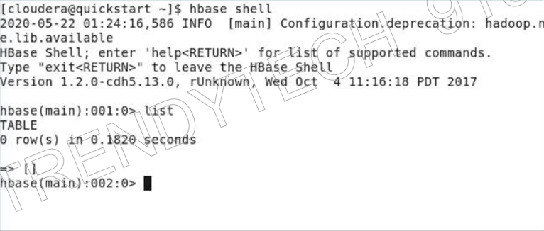

If you are having issue listing the tables in HBase, check if all the services are running. 
The error looks like below:
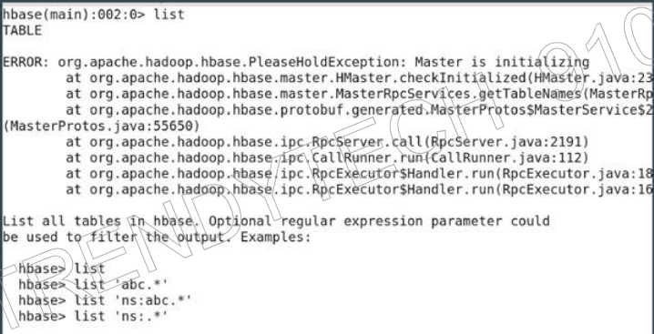

Shell script to check the status of all services
```sh
sudo service --status-all
``` 
**Note:** You only need to check for HBase Master & region-server, don't worry about other services.
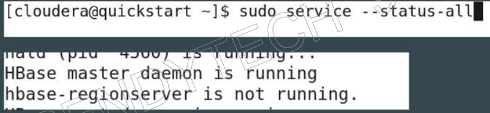

Inorder to restart these services, run the script below:
```sh
sudo service hbase-master restart
sudo service hbase-regionserver restart
``` 

Later `exit` and log back in using `hbase shell`.

### Creating Table named `Students` with three column-families:
```sh
create 'students', 'personal_details','contact_details','marks'
``` 
### Inserting values into `Students` table:
```sh
put 'students', 'student1', 'personal_details:name', 'Riyaz'
put 'students', 'student1', 'personal_details:email', 'riyaz@gmail.com'
``` 
Note:
- `student1` => row-key
- `personal_details` => column-family
- `name`/ `email` => column name
- `Riyaz` / `riyaz@gmail.com` => record

### Checking contents of the table:
```sh
scan 'students'
``` 
Note: scan will get all the records on the students table
The results are displayed as below:
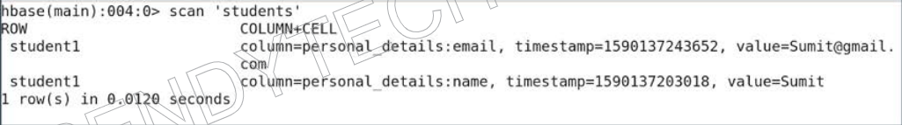

### Querying Row Key:
Instead of getting all the records using scan, if you want to retrieve row-key, use get:
```sh
get 'students', 'students1'
``` 
The results are displayed as below:
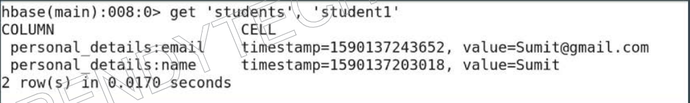

### Just query the column-family:
```sh
get 'students', 'students1', {COLUMN => 'personal_details'}
``` 
The results are displayed as below:
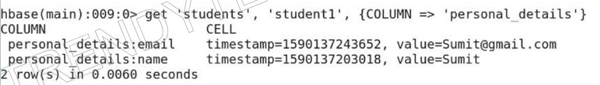

### Just query the column from a column-family:
```sh
get 'students', 'students1', {COLUMN => 'personal_details:name'}
``` 
The results are displayed as below:
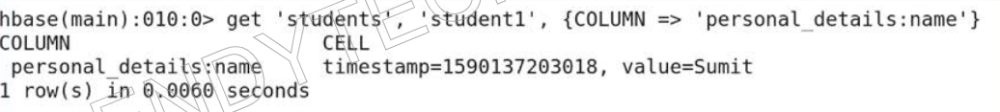

### Deleting the record from the table:
```sh
delete 'students','student1', 'personal_details:email'
```
The results are displayed as below:
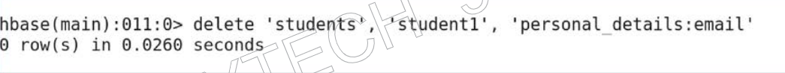

### Re-Check the results of the table using `scan`:
```sh
scan 'students'
``` 
The results are displayed as below:
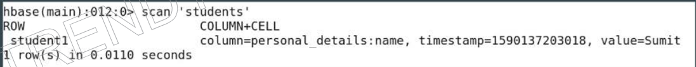

### Describe a table:
```sh
describe 'students'
``` 
The results are displayed as below:
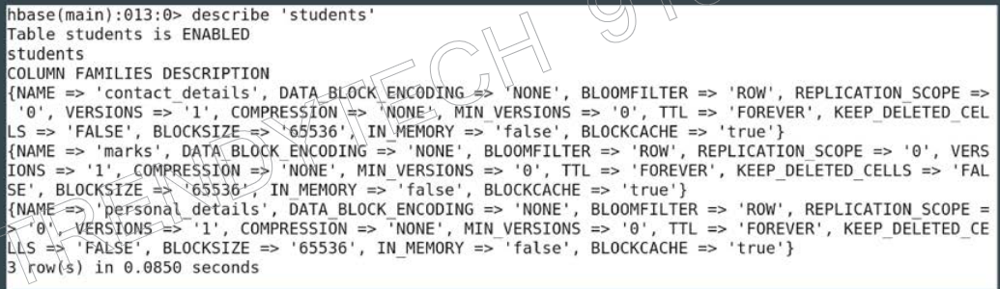

### Check if table exists
```sh
exists 'students'
``` 
The results are displayed as below:
`Table students does exist`

### Dropping a table:
To drop a table, it needs to be disabled. As the data is present in memstore and flush is not happened. When table is disabled, the content of the mem-store is flushed to disk and then the table can be dropped.

Disabling the table first:
```sh
disable 'students'
``` 
Then Dropping the table
```sh
drop 'students'
``` 
## Creating new table `Census`
```sh
create 'census', 'personal', 'professional'
``` 
`personal` & `professional` are 2 column families.

## Querying the data form `census` table:
```sh
scan 'census', {COLUMNS => ['personal:name'], STARTROW => 2, STOPROW => 4}
``` 
Note: STOPROW is exlusive of the number mentioned, just like range in Python.

## HBase Filter Operations

Types of filters:
1. Value Filter
2. Qualifier Filter
3. Family Filter

Example of Value Filter
```sh
scan 'census', {FILTER => "ValueFilter(=,'binary:Maria')"}
```
Results are displayed below:
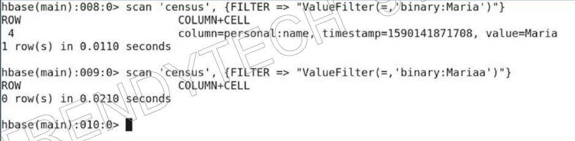

Example of Qualifier FIlter
```sh
scan 'census', {FILTER => "QualifierFilter(=,'substring:Name')"}
```
Results:
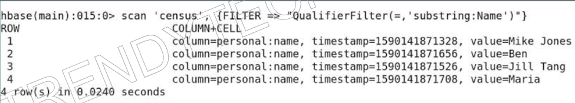

Example of Family Filter
```sh
scan 'census', {FILTER => "FamilyFilter(=,'substring:professional')"}
```
Results:
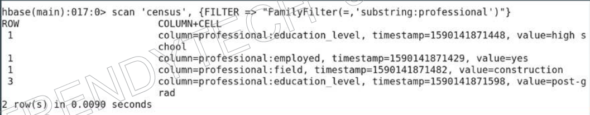

### Counting the number of records
```sh
count 'census'
```
