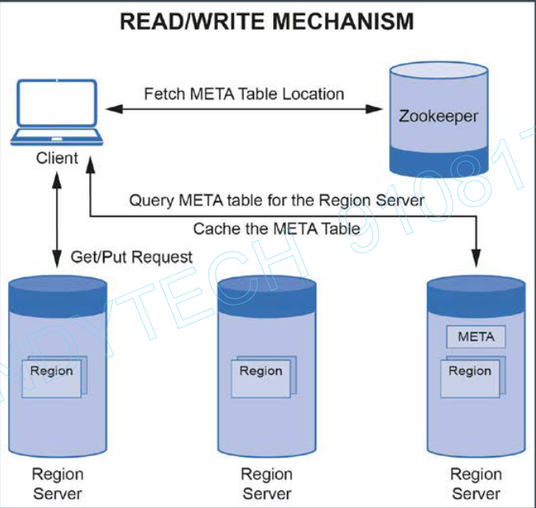
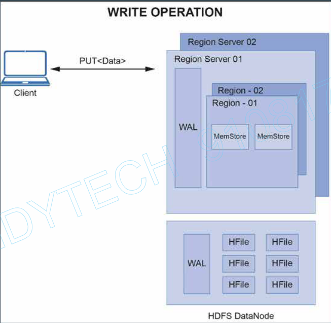
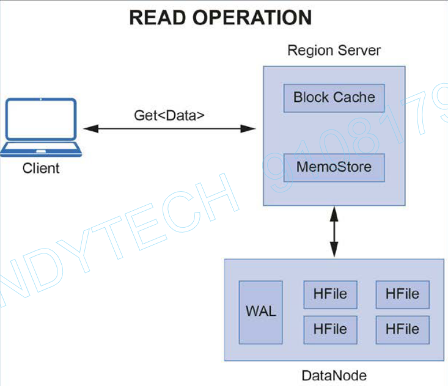

# HBase Read/Write Operations (21:00)

### The common steps involved in HBase read/write operations are as follows:

**Step1**: The client contacts the zookeeper to fetch the location of the META table (if the client doesn’t have the latest version of the META table already cached)

**Step2**: The client queries the META table to find the location of the region server, which has the region containing the row-key that the client is looking for.

**Step3**: The client caches the identified region server information as well as the META table location for future interactions.

**Step4**: The client can now communicate with the specific region server, identified in the step 2 above. This region server assigns the request to the specific region, where the read/write operations can be executed.

### HBase Write Operation

**Step1**: The data first needs to be written to the WAL, which is a write-ahead Log. WAL stores the new or updated data that has not been written to the HDFS and can be used for recovery, incase of a region failure.

**Step2**: Once the data is written to the WAL, it is placed in the MemStore of a region. When the MemStore becomes full, its contents are flushed to HDFS (DataNode) to form a new HFile.

**Step3**: Finally, an acknowledgement is sent back to the client.

### HBase Read Operation:

**Step1**: The region server first checks the block cache of the region server that stores the recently accessed data.

Step2: In case the data is not available in the block cache, it checks for the required data in the in-memory store i.e. MemStore

Step3: If the MemStore doesn’t contain that particular key-value, the HFile containing that particular key-value pair is identified.

Once the HFile is identified, instead of reading the entire HFile (~GB size), the Data Block Index of the HFile is scanned to get the Data Block with the Key-Value pair, A binary search in this data block finally returns the key-value pair (or null in case it doesn’t exist).

