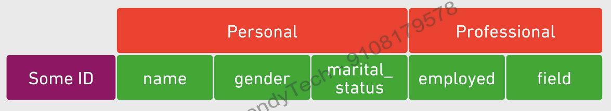
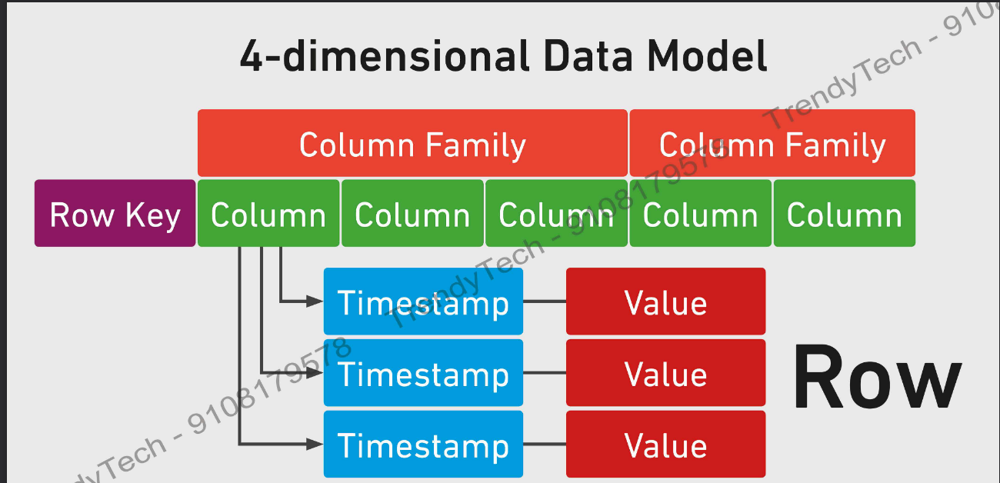

# Getting started with NoSQL-HBASE

### There are 4 requirements for a database
1. In a database, data is stored in a Structured manner (rows & columns)
2. Database will give you Random Access to your data.
3. Database provides you low latency, takes less time to search a row.
4. Databases offers `ACID` complaince.

**`A`** - Atomicity => A financial transaction occuring should deduct from the sender and credit the receiver. Either both of these should happen or none of these should heppen.  
**`C`** - Consistency => The constraints should be met, none of the constraints should be violated. e.g: primary key should be unique.  
**`I`** - Isolation => Concurrent operations on the database should appear as though they were applied in some sequence. If two persons are operating on a row, making operations on that row, the operation should happen in some defined order/sequence. There should be no dead locks.  
**`D`** - Durability => In case of power loss, crashes or errors, the data is not lost. Safety of the data is paramount.

**Unfortunately, Hadoop is not a database: Limitations of Hadoop**  
The following are the characteristics of Hadoop, which are completely opposite to a traditional database:
1. Unstructured data - Instead of rows & columns, data is stored in the form of files.
2. No random access: HDFS doesn’t have indexing to pull the data randomly, any predicate has to go through the entire block of data to give the results out.
3. High Latency - It takes too much time to retrieve data from HDFS.
4. Not ACID compliant - There is a risk of inconsistency in the data if it’s not ACID.

But we want all the issues to be resolved and want all the benefits of a database in Hadoop.

Google came up with `Big Table` - A distributed storage system for structured data. This is implemented as HBase in Hadoop Eco System.  

**`HBase`** - A distributed database management system which runs on top of Hadoop.

*Features*:
- Distributed: Stores data on HDFS.
- Scalable: Capacity directly proportional to number of nodes in the cluster.
- Fault Tolerant: Piggybacks on Hadoop.
- Structured: A Columnar Store, a loose data structure
- Low Latency: Real-time access using row based indices called row keys.
- Random Access: Row keys allow access updates to one record.
- ACID Complaince: Some transactions will have ACID transactions.

HBase can offer 2 things:
1. provides you quick searching based on row keys.
2. provides processing which is also provided by Map Reduce.

### HBase vs Relational Databases

The layout of traditional database is that it stores the data row-wise. Where as HBase is a columnar oriented database, that means it stores the data column-wise.  

### Advantages of a columnar store:
1. Sparse Tables: Traditional databases create Dense tables over a period of time, as there might be null values in multiple columns. In columnar storage, the column/key is eliminated where there is no value associated with it. These are called Sparse tables which are compact and very efficient. No wastage of space when storing sparse data
2. Denormalization: Data has to be stored in one big table rather than dividing the tables into multiple chunks (normalization). This will minimize the disk seek while querying.
3. Only CRUD operations could be performed, cannot perform Joins, GroupBy, OrderBy. This is why data needs to be self contained in one row.
4. ACID Compliance - HBase provides ACID compliance at row level. Whenever we are trying to update multiple columns for a single row, then either all of them are updated or none of them are updated. *Updates to multiple rows are not Atomic*

### How data is laid out in HBase:

HBase has 4-dimensional Data Model
1. Row Key
2. Column Family
3. Column
4. Timestamp

`Row Key` - A unique identifier for each record. Internally represented as a byte array. Sorted in Ascending order.  
`Columns` are logically grouped into `Column Families`. Later you can name this column family. E.g: columns dept, grade & title are grouped together under work column family. Each Column Family is stored in a separate data file.  

`Timestamp` shows the versioning of a record and fetches an updated record whenever it is queried with latest timestamp.

